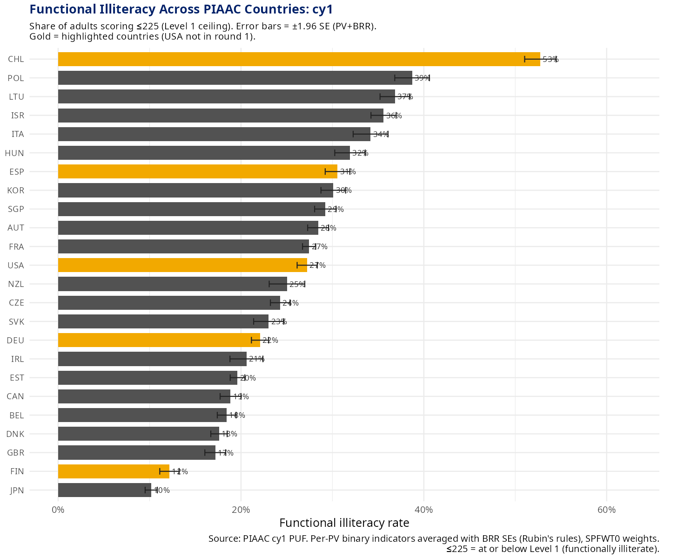
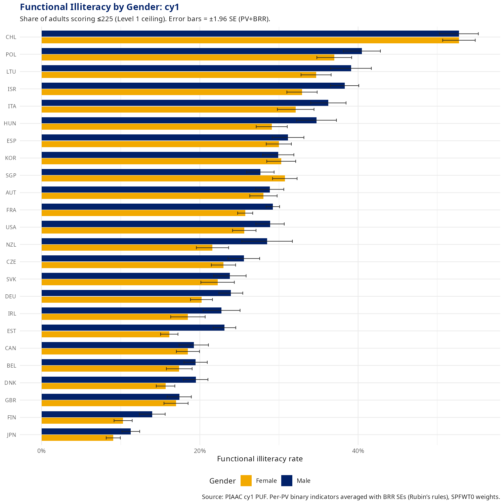
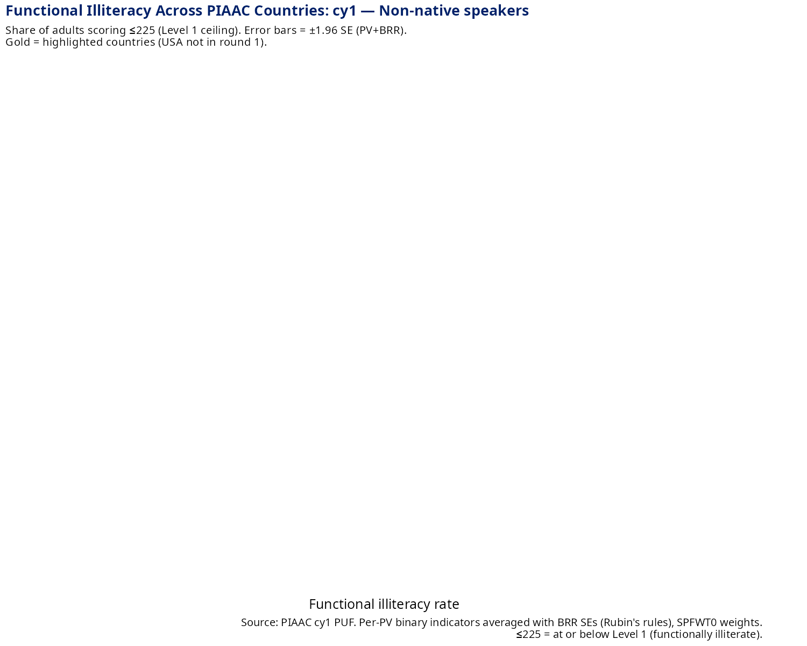
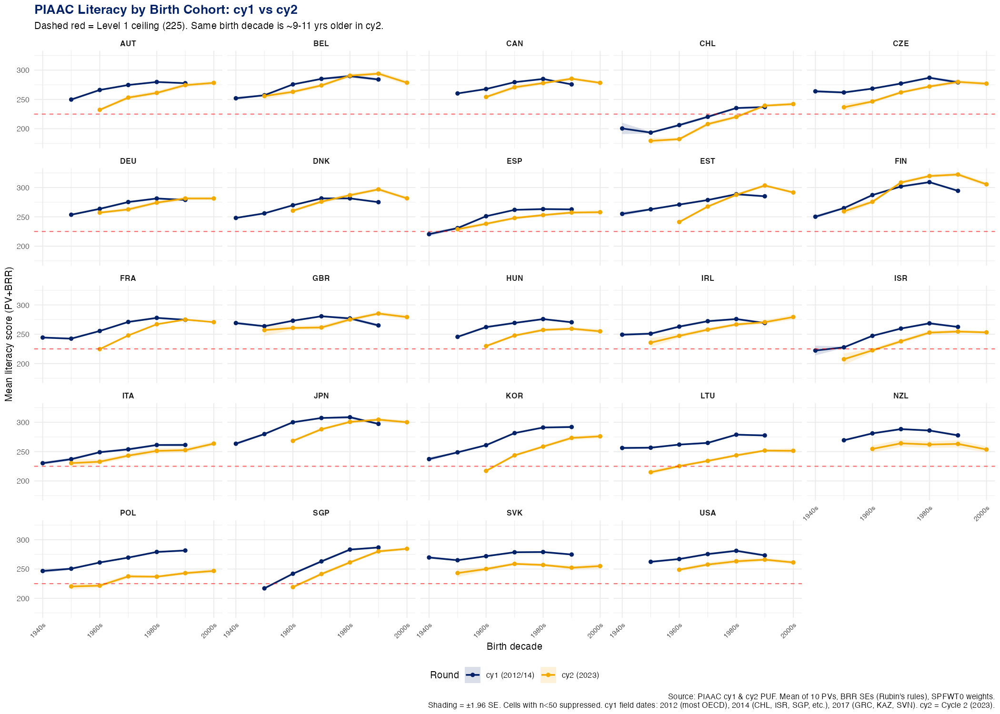
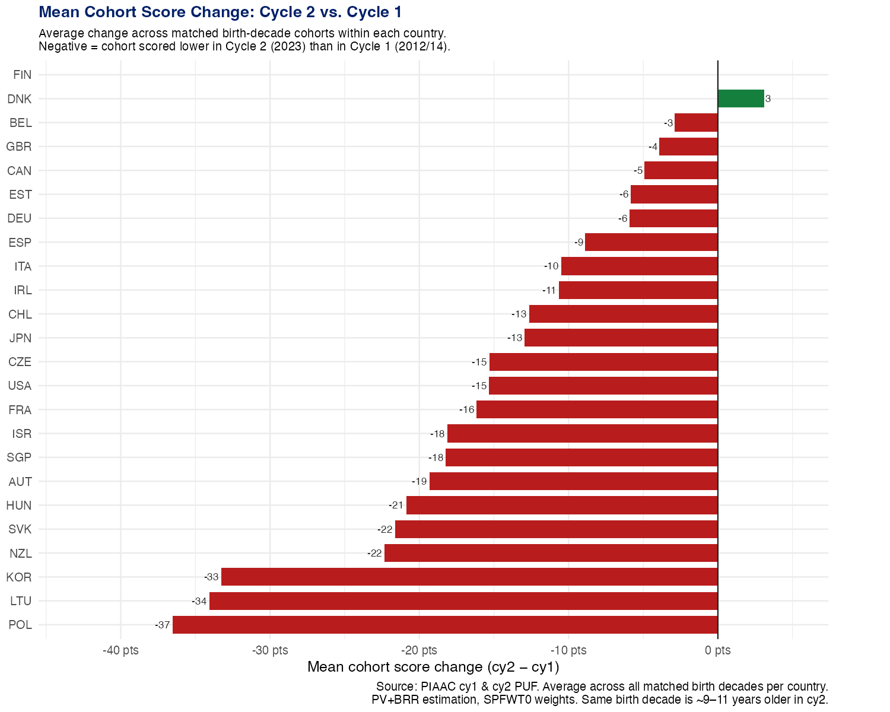
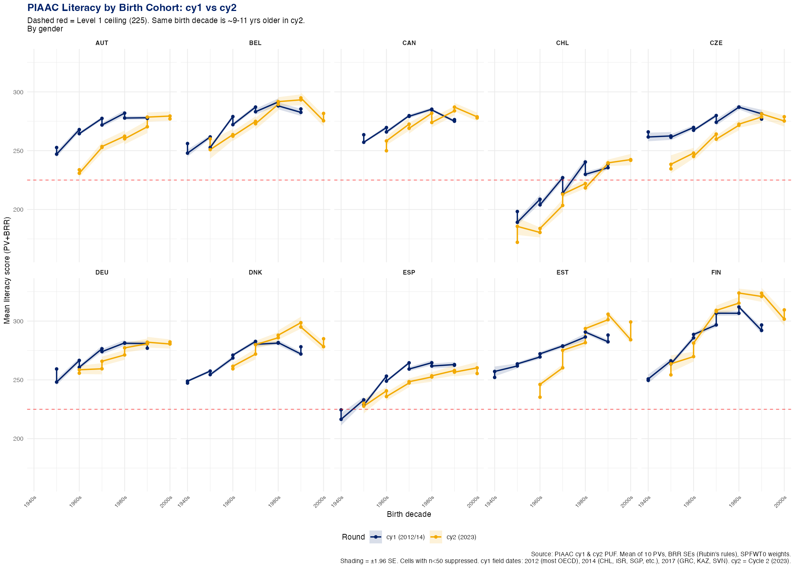
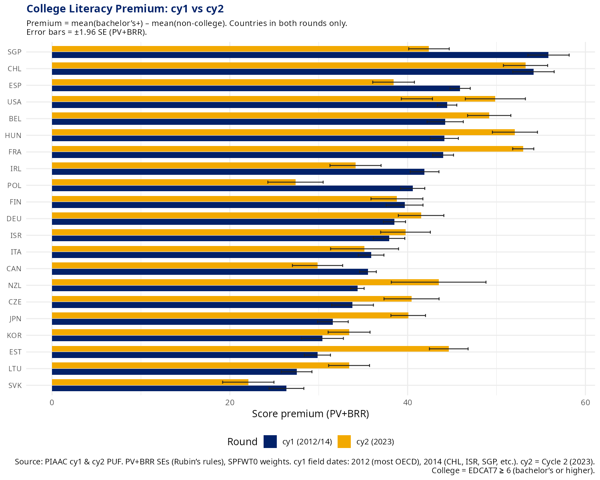
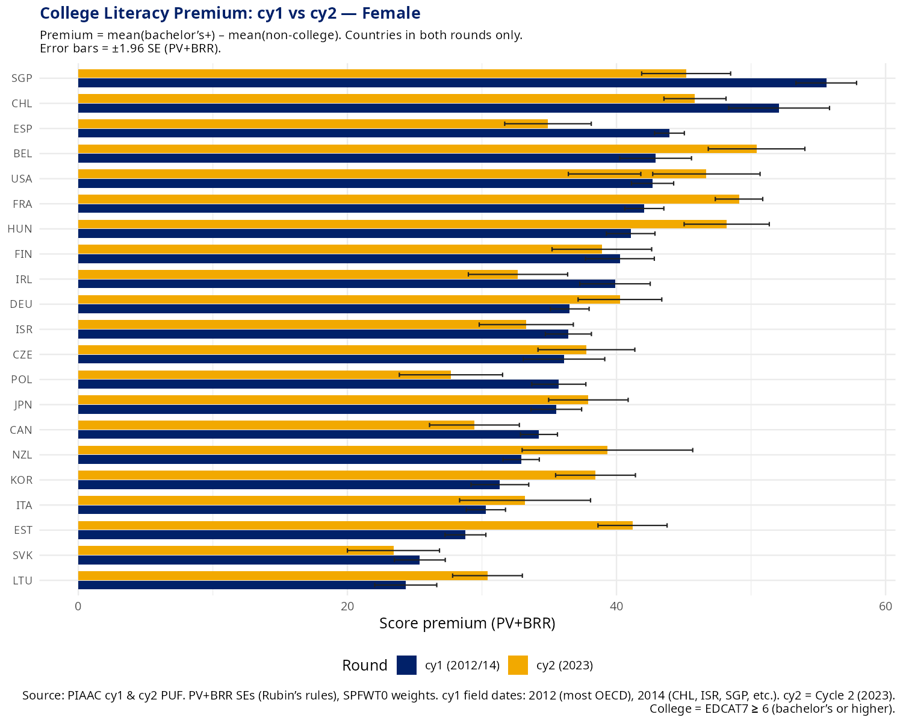

### LEAD WITH BIG NUMBERS

### THE PUZZLE DISCONNECT BETWEEN PISA AND PIAAC

### Various people have looked and its not a measurement issue. The PISA gains were real, but they did not translate into adult skills.

### MATT SAID we looked at the comments as we all know the first stage is denial and then fear and then anger and then bargaining and then acceptance. We are somewhere between denial and fear right now.

## The Puzzle

Here is a fact that should be unsettling. In the United States, roughly 18 percent of adults are functionally illiterate—unable to perform basic reading tasks like understanding a medication label or following simple written instructions. That number comes from the OECD's Programme for the International Assessment of Adult Competencies (PIAAC), which defines functional illiteracy as scoring at or below Level 1, a threshold of 225 points on a 500-point scale.

But the US is not alone. Germany sits at 17 percent. Spain at 27 percent. Chile at 53 percent and Peru at 70 percent.

What makes these numbers strange is that all three of these surveys—2012/14, 2017, and 2023—took place after decades of rising school enrollment, credential attainment, and education spending. By most conventional metrics, the world has never been more educated. So why are adult literacy scores not reflecting that?

Digging into the PIAAC data, we find three findings that compound into a single unsettling story: adult literacy may have peaked sometime around 2015, and in many countries it has been declining since.

## The Data

PIAAC is the most rigorous international adult skills survey available. Run by the OECD, it assesses literacy, numeracy, and problem-solving among adults aged 16–65 in participating countries. Crucially, it has now been administered in three rounds:

- **Cycle 1, Round 1 (2012/14):** 21 high-income countries
- **Cycle 1, Round 2 (2014/17):** ~14 additional countries, including several Latin American and Eastern European nations
- **Cycle 2 (2023):** 24 countries, many of which also participated in Cycle 1

The United States participated in Cycle 1 (2012) and Cycle 2 (2023), making it one of 24 countries for which cohort tracking is possible.

The survey uses plausible values and replicate weights, allowing for precise population-level estimates with appropriate uncertainty quantification. All results reported here use proper PV+BRR variance estimation following OECD guidelines. PIAAC Cycle 2 used a redesigned computer-adaptive assessment format; the OECD conducted equating studies to maintain cross-cycle comparability, though any such comparison rests on the assumption that this equating is successful.

## Finding 1: A Wide Cross-Country Spread in Functional Illiteracy

The cross-country picture is stark. Japan leads with just 4.7 percent of adults functionally illiterate; Finland (10%), Norway (12%), and Sweden (13%) cluster near the top of the distribution. But much of the world sits far above these benchmarks.

Latin American countries—Ecuador and Peru top the list at 70–71 percent, followed by Chile (53 percent) and Mexico (50 percent). Turkey sits at 46 percent. Even wealthy OECD countries such as Israel, Italy, and Spain (each around 27 percent) lag well behind Scandinavia. The United States (18 percent) and Germany (17 percent) sit in the middle of the distribution.

The gender gap is consistently present but modest in most countries: women and men perform similarly in the Nordic countries, while gaps widen in countries with lower overall literacy.

One striking pattern appears when disaggregating by immigrant generation:

Non-native speakers show substantially higher illiteracy rates in almost every country, but the gaps are narrower than expected in several cases—suggesting that within-country sorting (where to live, what credentials to pursue) shapes measured literacy as much as language background does.

## Finding 2: Cohort Tracking Shows Scores Are Declining

The most troubling finding emerges when we track the *same birth cohorts* across survey rounds. PIAAC's 10-year age bands make this possible: the 25–34 year-olds surveyed in 2012 are (approximately) the 35–44 year-olds surveyed in 2023. Net of migration, we can follow generations through time.

Among the 24 countries that participated in both Cycle 1 and Cycle 2, **all 24 show score declines for the same birth cohort across rounds.** The declines are large:

- Poland: −37 points
- Lithuania: −34 points
- Korea: −34 points
- New Zealand: −22 points
- Slovakia: −22 points
- Hungary: −22 points
- Israel: −20 points
- Czech Republic: −20 points
- Singapore: −18 points
- France: −17 points
- Japan, United States: −14 to −15 points
- Austria, Chile, Ireland, Italy, Spain: −10 to −13 points

Finland shows the smallest decline at under 1 point.

For context: PIAAC Level 2 spans 226 to 275 points—roughly 50 points above the functional illiteracy threshold. Declines of the magnitude observed here are not statistical noise: they are generation-defining changes.

The decline appears across genders, though the magnitudes vary:

A natural objection is that some of the measured decline reflects aging—older people score lower on cognitive assessments, and even though we are tracking the same *cohort*, the individuals are 8–10 years older in the second survey. This is a real concern, and disentangling aging from genuine cohort decline requires careful modeling. Cross-sectional PIAAC data suggest an age gradient of roughly 1–2 points per year, implying 10–20 points of expected decline from aging alone over the ~11-year gap between surveys. For countries showing declines in that range—Austria, Chile, Ireland, Italy, Spain—aging alone may account for much of the change. But for Poland (−37 points), Lithuania (−34), and Korea (−34), the declines are far larger than aging can plausibly explain, pointing to something more: a genuine deterioration in the skills of these birth cohorts over time. Because PIAAC is a repeated cross-section rather than a panel, compositional changes from migration and differential non-response could also contribute, but these are unlikely to be large enough to explain the magnitude of decline in the hardest-hit countries.

## Finding 3: The College Premium Is Compressing

The third puzzle concerns the return to college education. Consider two different birth cohorts. In the early 2010s, adults aged 40–44 (born around 1970, when roughly 15 percent attended college) had average literacy scores around 220. That gives us `0.15·X + 0.85·Y ≈ 220`, where X is the mean score for college graduates and Y for non-graduates. A younger cohort—adults aged 30–34 in 2023 (born around 1990), who grew up during a college enrollment boom, with roughly 50 percent college-going rates—scores similarly after adjusting for age. That means `0.5·X + 0.5·Y ≈ 220` as well.

If the overall mean is roughly the same across both cohorts, the gap between X and Y (the college–non-college score difference) must have collapsed substantially.

The data show a mixed picture across countries:

The college premium in literacy—how many points higher college graduates score than non-graduates—has moved in opposite directions across countries. Among the 20 countries with college premium data in both rounds, 9 show declines and 11 show increases. The picture is more mixed than the back-of-envelope calculation suggested.

The biggest declines are in Singapore (−13 points), Poland (−13), Ireland (−8), Spain (−7), and Canada (−6). The United States, by contrast, shows a slight *increase* in the college premium (+5 points, from 44 to 50 points), as do France (+9), Estonia (+15), New Zealand (+9), and Japan (+8).

The divergence across countries is itself informative. Two explanations are consistent with the data and not mutually exclusive:

1. **More students are going to college, including weaker students.** As enrollment rates rise, the marginal college entrant is less academically selected. Average graduate skills fall even as total credential attainment rises—compressing the premium from above.
2. **Non-graduates are falling further.** In countries where the US-style premium is rising, non-college workers may be losing skills faster than graduates, widening the gap from below.

The divergence between the US (widening premium) and countries like Poland and Singapore (narrowing premium) may reflect differences in how quickly less-selective college expansion reached each country, or differences in how much the non-college labor market supports ongoing skill use.

## The Deeper Mystery: When PISA Gains Don't Show Up in PIAAC

Perhaps the most puzzling data point in this analysis concerns Chile. Chile's 15-year-olds made remarkable gains on PISA (the OECD's school-age assessment) between 2000 and 2009—improvements of roughly 0.4 standard deviations, among the largest in the world. These students should be the 25–34 year-old cohort in the 2023 PIAAC survey. Yet their PIAAC scores are essentially identical to the cohort that preceded them—students who performed far worse on PISA in 2000.

The gains at age 15 simply did not translate into adult skills by age 30–35.

Measurement differences between PISA and PIAAC—different item pools, different target populations, different test formats—cannot be ruled out as a partial explanation. But if the PISA gains were real, the fact that they do not appear in adult literacy scores a decade later raises questions about the durability of skills acquired during schooling. Skills measured at age 15 may not persist unless reinforced through work and daily life in adulthood. And for many populations, it appears they are not.

## What Is Going On?

The honest answer is: we don't fully know yet. But the pattern across three findings—universally falling cohort scores, stubborn illiteracy rates, and a diverging college premium—is consistent with a story in which:

- Schools are producing credentials faster than skills
- The adult environment (work, leisure, civic life) is not maintaining or building the skills that school begins to develop
- Where the college premium is rising (US, France, Estonia), it may reflect non-graduates losing ground faster than graduates, rather than graduates improving
- Where the college premium is falling (Poland, Singapore, Ireland), rapid expansion of higher education may be diluting average graduate quality

If that story is right, then standard education statistics—enrollment rates, years of schooling, graduation rates—are telling us something misleading about human capital. The credential is not the skill.

PIAAC gives us one of the few direct windows into adult skills across time and countries. The view through that window right now is not reassuring.

---

*Data and replication code for this analysis are available at [repository TBD]. All figures use population weights and PV+BRR variance estimation following OECD (2023) guidelines.*

*The authors thank [TBD] for helpful discussions.*
