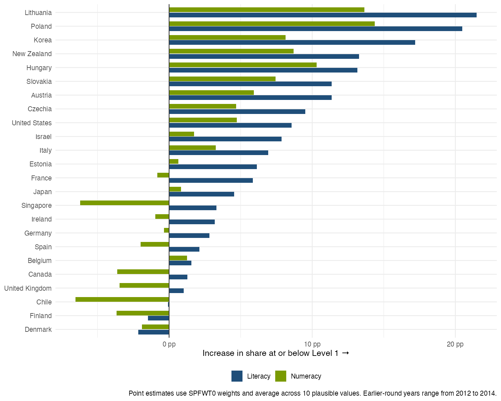
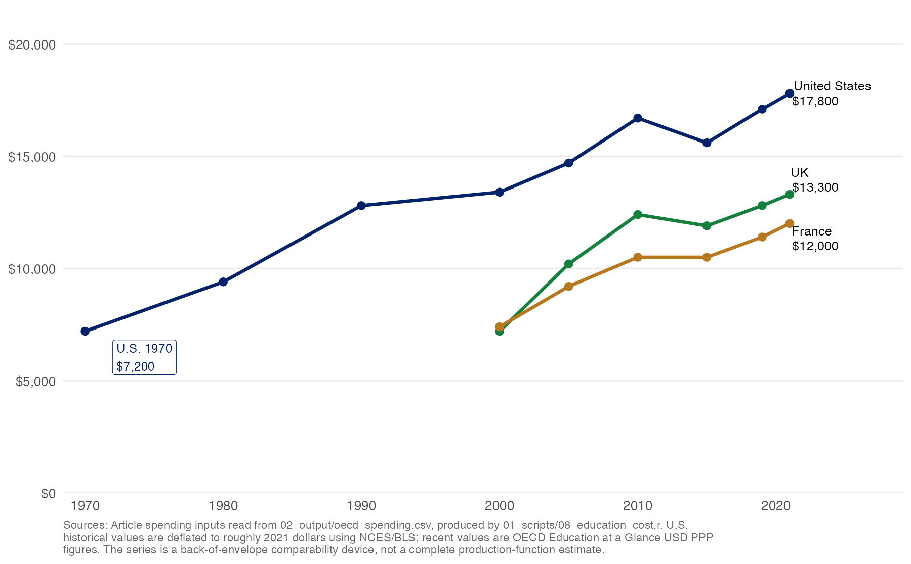
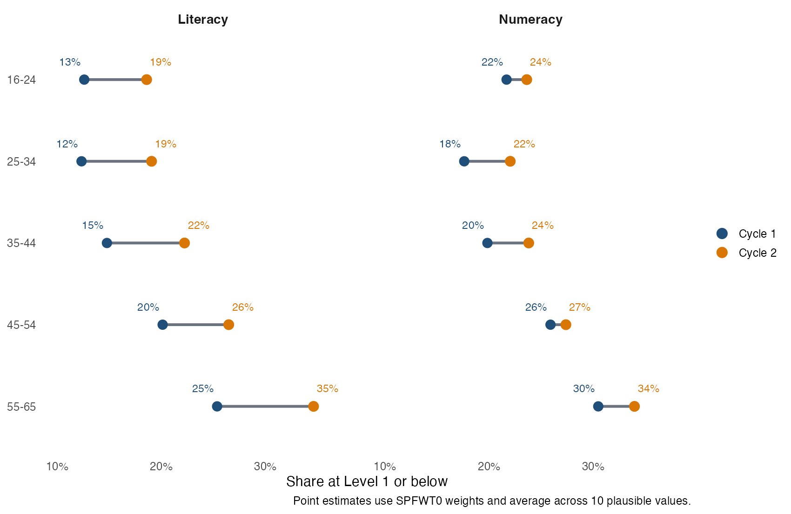

Jonathan Kozol's *Illiterate America* contains a small story that still has the power to unsettle. A young man, unable to read, had learned how to survive in restaurants by studying the menu for a long time and then ordering the one meal that almost every kitchen could produce: a hamburger and a Coke. When Kozol took him to a more formal restaurant, the young man asked if they could leave. His preferred restaurant was Howard Johnson's. The reason was not the food. It was that Howard Johnson's had pictures on the menu.[^kozol-menu]

The point of the story is not nostalgia for a vanished America. It is that low literacy is often hidden in plain sight. People do not walk around announcing that they cannot read a form, compare two notices, or understand a prescription label. They route around the problem. They memorize. They ask someone else. They choose the place with pictures.

The usual reaction to a story like this is also telling. First comes sympathy. Then comes reassurance. Surely that was then. Surely things are much better now. The United States and Europe have spent decades expanding schooling, raising graduation rates, building colleges, digitizing classrooms, and telling themselves that the knowledge economy had arrived. A society that has made school nearly universal should not still be producing adults who are frightened by ordinary text.

But here is the uncomfortable fact. The old kind of illiteracy, the kind the Census Bureau used to ask about, really did collapse. In 1920, about 6 percent of Americans age 14 and older were classified as unable to read or write in any language. By 1950, the figure was about 3 percent, and by 1979 it was below 1 percent.[^nces-history] On that narrow measure, the war was largely won.

The problem we measure now is not simply whether adults can recognize letters or write their names. It is whether they can use written information to get through the ordinary business of life. That distinction matters because the old literacy question and the modern literacy problem are not the same thing. People in 1920 also had leases, labels, instructions, and forms. But the old statistic asked a thinner question. A society can nearly eliminate the most basic inability to read and still leave millions of adults unable to comprehend, compare, infer, and act on written information.

A prescription label, a lease, a school notice, a benefits form, a workplace safety sheet, a bank app, a bus timetable, a menu without pictures: these are not specialized texts. They are the wallpaper of ordinary citizenship. The demand is not just decoding. It is comprehension.

And on that measure, progress looks much less triumphant.

In the United States, roughly 58 million adults age 16 to 65 scored at or below Level 1 in literacy in the 2023 round of PIAAC, the OECD's international survey of adult skills. That is about 27 percent in the public-use file we use here, close to the official NCES figure of 28 percent. In 2017, the comparable official figure was 19 percent.[^nces-us-2023] In numeracy, the low-performing share rose from 29 percent to 34 percent.

These are not obscure margins of the population. They are one out of every four adults in literacy and one out of every three in numeracy.

The deeper shock is among the young. Among Americans age 16 to 24, the share at or below Level 1 in literacy rose from about 14 percent in the combined 2012/14 PIAAC file to about 24 percent in 2023. There are approximately 39 million Americans in that age band. By our estimates, about 9.5 million of them are leaving school or entering adulthood already in the low-literacy range.

That is the part that should stop us. This is not simply a story about older workers who went to school in a different era. It is not simply a story about the decline of mid-century manufacturing towns or about people left behind by a digital economy. It is happening at the front end of adulthood, after the largest and most expensive educational build-out in human history.

## What PIAAC Measures

PIAAC, the Programme for the International Assessment of Adult Competencies, is the closest thing we have to a global medical exam for adult human capital. Run by the OECD, it tests adults in literacy, numeracy, and, in the most recent cycle, adaptive problem solving. The target population is adults age 16 to 65 living in households, and the assessment is designed to measure how people use information in realistic adult tasks.[^oecd-piaac]

The scale runs from 0 to 500. In literacy and numeracy, OECD reports six proficiency bands: below Level 1, Level 1, Level 2, Level 3, Level 4, and Level 5. In this piece we call adults "functionally illiterate" when they score at or below Level 1 in literacy, meaning 225 points or below. That is a shorthand, and it should be used honestly. OECD usually calls this "low literacy proficiency," not illiteracy.

But the phrase captures something important. Adults at Level 1 can generally manage short texts and organized lists when the relevant information is clearly indicated. Adults below Level 1 may only be able to understand very short, simple sentences.[^oecd-literacy] NCES describes adults at or below Level 1 as at risk of difficulty using or comprehending print material; those at the upper end may fill out a short form, while inference, comparison, or combining information across texts may be too hard.[^nces-skills-map]

In practical terms, this is the difference between reading words and using text as a tool. A person at or below Level 1 may be able to read a familiar sentence, find one clearly labeled fact, or copy information into a simple form. The trouble begins when the task requires more than lookup: comparing two notices, deciding which warning applies, following a multi-step instruction, finding the relevant line in a table, understanding a condition buried in a paragraph, or checking whether a search result answers the question being asked.

Think of ordinary adult life. A parent gets a school form that asks for consent but also includes exceptions. A worker receives a safety sheet with several conditions. A patient reads medication instructions that change by time of day or by symptom. A tenant tries to understand which fee is due and which one can be contested. A job applicant has to move through a portal, interpret prompts, upload documents, and notice what is missing. None of these tasks requires literary sophistication. They require enough reading to avoid being trapped by the institutions that now govern daily life.

That distinction matters. The point is not that every adult below 225 is helpless. Many people in this group work, raise families, navigate neighborhoods, and find ingenious ways around written systems that were not designed for them. The point is that modern societies increasingly assume everyone can read and compare, infer and verify, fill and file, search and judge.

That assumption is false.

## A Crisis That Is Not Only American

In 2023, among the 24 countries we can compare directly between an earlier PIAAC participation and a 2023 participation, the population-weighted share of adults at or below Level 1 in literacy rose from about 18 percent to about 25 percent. In levels, that is an increase from roughly 115 million to 155 million adults in the low-literacy range across this overlap sample alone.

The United States is bad, but it is not alone. Lithuania rose from 15 percent to 37 percent. Poland from 18 percent to 39 percent. Korea from 13 percent to 30 percent. France from 21 percent to 27 percent. Germany from 17 percent to 20 percent. Japan remains one of the strongest performers, but even there the low-literacy share rose from about 5 percent to 9 percent. Chile is the striking high-level exception in this particular change table: it starts at an extraordinary 53 percent and stays there.

The figure above is almost too crowded to absorb, but the simple fact is visible: in 21 of the 24 comparable countries, the share of adults at or below Level 1 in literacy increased. Numeracy is more mixed, but not reassuring. Across the same countries, the low-numeracy population rose from roughly 156 million to 166 million adults.

This is the first reason the usual explanations do not feel sufficient. If the problem were just one country's curriculum, one country's politics, or one country's pandemic response, the pattern would not look like this. There are national differences, and they are huge. But the broad pattern is visible across very different education systems and labor markets.

It is also a strangely under-covered story. When the *Financial Times* published one of the relatively rare articles on literacy decline, the comment section did not converge on a single interpretation.[^ft-comments] Some readers accepted the finding as grim confirmation of what they saw in schools, workplaces, or politics. Others rejected it as exaggerated, badly measured, or confused with migration and language. Many reached for references, jokes, political explanations, or personal anecdotes. A comment thread is not a survey, and a keyword classifier is not public opinion. But the reaction is a useful clue: even among people willing to read and argue about the problem, there is no common narrative for what has happened.

That absence of a narrative matters. Problems are easier for politics to ignore when no one agrees on what kind of problem they are.

## The Cost Of Producing Basic Literacy

The second reason the puzzle is so hard is that rich countries did not stop spending on education. Quite the opposite.

The figure below uses the same per-pupil spending inputs as the back-of-the-envelope calculation in this piece. The series is narrower than total education budgets: it is annual primary and secondary spending per student. That is the right unit for the argument here, because the question is not whether education has become a larger line in the national accounts. It is whether the cost of producing a young adult with basic literacy has risen.

In the United States, annual spending per pupil rose from about $7,200 in 1970 to $17,800 in 2021, roughly a two-and-a-half-fold increase. Britain and France do not have the same long historical series in our article inputs, but in the years where we observe them they sit well below the U.S. level. These are not tiny changes at the edge of the budget.

Now put that beside the PIAAC results for young adults. The United States spends roughly $17,800 per pupil per year in primary and secondary education, measured in OECD purchasing-power terms. A rough K-12 bill is therefore about $231,000 per student over 13 years. In 2023, about 76 percent of Americans age 16 to 24 scored above the low-literacy threshold. Divide the cumulative K-12 spending by that success rate, and the cost of producing one young adult above Level 1 is about $305,000.

In the early 1970s, using historical U.S. spending of roughly $7,200 per pupil in today's dollars and the earliest PIAAC young-adult literacy rate as a conservative benchmark, the analogous number is about $109,000. This is not a precise production function. It is not meant to pretend that every dollar of K-12 spending maps cleanly into one test score at age 20. But as a social accounting exercise, it is bracing.

The United States is spending far more to produce a young adult who clears a very low bar.

The comparison with Britain and France makes the point sharper. In the U.K., young adult low literacy appears to have fallen from about 18 percent to 12 percent between 2012 and 2023, while per-student spending is lower than in the United States. In France, low literacy among 16- to 24-year-olds rose from about 13 percent to 16 percent, pushing the cost per literate young adult in the wrong direction but still far below the U.S. figure.

Economists have a phrase for this kind of pattern: productivity slowdown. We usually apply it to firms, hospitals, construction, or public infrastructure. But education may be one of the most important productivity puzzles of all. The West has built systems that are astonishingly good at producing years of schooling and credentials. They are much less clearly good at producing durable adult skills.

That is the great education paradox. Schooling has expanded. Spending has risen. Credentials have multiplied. Yet the basic measured skills that allow adults to function in a text-saturated society have stagnated or fallen.

## Where Could The Decline Come From?

Before asking what to do, it helps to ask a simpler question: how could a national adult-literacy number move?

There are three possibilities.

The first is that the population changes. Imagine a country with 100 adults: 50 younger adults and 50 older adults. Suppose 10 percent of the younger group and 25 percent of the older group are in the low-literacy range. The national rate is a weighted average of those two rates. If the country gets older, the national rate can rise even if neither group gets any worse. This is the composition story.

The second possibility is that people inside the same broad groups look worse than before. If younger adults in 2023 have higher low-literacy rates than younger adults did in 2012, that cannot be explained by the country simply having more older people. Something changed within the young group.

The third possibility is harder, because time stacks several stories on top of one another. A 55-year-old measured in 2023 is in the same age box as a 55-year-old measured in 2012, but they are not from the same generation and they are not being tested in the same historical moment. Maybe adults lose measured literacy as they age. Maybe people born in different decades received different schooling or faced different labor markets. Maybe 2023 itself was an unusual testing environment. These are the age, cohort, and period stories.

The catch is that they fit together too neatly. Birth year is just survey year minus age. Once we know two of the three, the third is determined. With two main PIAAC cycles, no statistical trick can perfectly separate aging, generations, and the historical moment. The honest approach is therefore more modest: use each check to rule out the easy explanations, and be clear about what remains uncertain.

## Is This Just Demography?

Aging matters. In cross-section, older adults are much more likely to score at or below Level 1. In the pooled PIAAC overlap sample, low literacy in Cycle 1 was about 13 percent among 16- to 24-year-olds and 25 percent among 55- to 65-year-olds. In Cycle 2, those figures were about 19 percent and 35 percent.

But aging cannot be the whole story, for a simple reason: low literacy rose within age groups too.

Among 16- to 24-year-olds in the pooled overlap sample, low literacy rose from about 13 percent to 19 percent. Among 25- to 34-year-olds, it rose from about 12 percent to 19 percent. Among 35- to 44-year-olds, from about 15 percent to 22 percent. The elderly share of the population matters, but it cannot explain why the young look worse too.

OECD's own reweighting exercises point in the same direction. Reweighting Cycle 2 so that it resembles Cycle 1 in age, immigrant background, and gender changes the country estimates, sometimes materially. But it does not make the cross-cycle decline disappear. In some countries, the adjusted decline is almost the same as the raw decline. In others, accounting for demographic change makes the fall look larger rather than smaller.

That still leaves the harder question: are we seeing aging, weaker cohorts, or something about the later survey period? We handled this as a set of accounting checks, not as a machine that reveals one true cause.

One check holds the country and the age band fixed and asks a plain question: compared with people in the same broad age group in the same country, are adults in the later round scoring lower? The answer is yes. The later round is about 7 points lower on the PIAAC literacy scale.

A second check asks whether the story can be pushed onto generations. If we assume away any general 2023 shock, younger birth cohorts do not appear with the large advantages one might expect after decades of educational expansion. A third check follows birth-decade groups as they age across rounds. This is useful descriptively, but it cannot tell us whether a cohort fell because it aged or because it was measured in 2023. A fourth check lets the 2023 shift differ by age group. The point estimates are worse at older ages, but the young are not spared.

The right interpretation is modest and important. The aggregate decline is not just the result of rich countries getting older, more immigrant, or more female. There is a broad deterioration left after basic demographic adjustment. Some of it may reflect cohort replacement, some may reflect adult skill decay, and some may reflect the survey-period complications of 2023. But the residual fact is hard to ignore: when we compare similar age groups within the same countries, the later PIAAC round looks worse.

That is the point to carry forward. The exact split among age, cohort, and period is still uncertain. The existence of the problem is not. Expensive education systems are producing and maintaining less basic proficiency than the public story of educational progress would lead us to expect.

## The School-To-Adulthood Leak

One way to see the problem is to ask what happens between school and adulthood. We often talk as if education produces a stock of human capital. A student learns to read, receives a diploma, and carries that skill forward. But skills are not marble statues. They are more like languages. They grow with use and weaken with neglect.

That possibility matters because the modern economy has two faces. One face demands more reading than ever: forms, screens, credentials, procedures, compliance documents, written instructions, digital navigation. The other face has made it easier than ever to avoid reading. Voice notes, videos, icons, autofill, GPS, recommendation algorithms, and bureaucratic intermediaries can all help people function without fully understanding text.

There is a humane side to that. Technology can reduce the shame and danger of low literacy. Pictures on menus helped Kozol's young neighbor survive a restaurant. Spoken directions help millions navigate cities. Translation apps lower real barriers for migrants. A society should not make daily life deliberately hard for people with weak reading skills.

But accommodation is not the same as capability. If adults can route around text more easily, schools may face less reinforcement from the rest of life. A child who leaves school barely able to read may become an adult who can get by without reading much at all. The problem becomes invisible until a crisis arrives: a court notice, a medical diagnosis, a job application, an eviction letter, a school form for a child.

That may be why this problem feels both enormous and strangely hidden. Low literacy is everywhere in the data and rarely visible in public life. People hide it. Institutions route around it. Politicians invoke it only in slogans. And because almost everyone has been to school, we confuse attendance with mastery.

## What Would A War On Illiteracy Mean Now?

Throughout the twentieth century, the language of literacy policy was bellicose: wars on illiteracy, campaigns, crusades. The metaphor made sense when the task was expanding basic schooling and teaching adults who had never had a chance to learn. It is much less clear what it means now.

The adults at or below PIAAC Level 1 are not all the same. Some are native-born adults failed by school systems. Some are immigrants who may be literate in another language but not in the language of the test. Some are older adults whose skills have declined. Some have disabilities. Some left school with weak skills and then spent decades in jobs and lives that did not require much reading. Some are young people who recently completed many years of formal education and still do not read well enough.

A serious policy response would have to stop treating them as one population.

For children, the lesson is uncomfortable but direct: early reading has to become non-negotiable. Not in the sense of slogans about standards, but in the operational sense of identifying weak readers early, using evidence-based instruction, giving schools the time and staff to intervene, and refusing to let social promotion disguise non-mastery. If a student cannot read fluently by the end of primary school, the rest of schooling becomes an exercise in concealment.

For adolescents, the task is harder. Many systems quietly give up on reading after the early grades. But PIAAC suggests that failure to build usable literacy by the late teen years is not a temporary blemish. It is a forecast of adult vulnerability. Secondary schools need serious reading and numeracy repair, not only credit recovery.

For adults, the answer cannot be a nostalgic return to night school alone. Adult basic education has long been underfunded, small, and hard to scale. The more promising strategy may be to embed literacy and numeracy into the places adults already are: community colleges, workplaces, health systems, benefit offices, unions, correctional programs, libraries, and digital public services. The point is not to ask adults to return to school as children. It is to rebuild skills around adult purposes.

And for researchers, there is a measurement agenda. We need to know how much of the 2023 shift reflects true skill loss, how much reflects migration and language, how much reflects nonresponse, and how much reflects the redesigned Cycle 2 assessment. Following OECD's proficiency-table convention, the main estimates here exclude adults who only completed the Cycle 2 doorstep interview. Those adults are substantively important, but mixing them into cross-cycle trend claims would make the comparison less clean. These caveats do not make the problem disappear. They tell us where to look before we pretend to know its cause.

## The Stakes

There is a temptation, when faced with numbers this large, to turn apocalyptic. A post-literate society. The end of the West. Civilizational decline. The temptation is understandable. The numbers are frightening.

But the more useful response is quieter and, in some ways, more damning. Rich countries have built education systems that are extraordinarily expensive and only partially successful at their most basic promise. We have celebrated the growth of enrollment, years of schooling, college attendance, and credentials. We have assumed that these were good measures of human capital because they were easy to count and moved in the right direction.

PIAAC is telling us that the credential is not the skill.

If one in four adults struggles with the written demands of modern life, the problem is not only theirs. It is a design failure of the society around them. We have made reading more necessary, made school more expensive, made credentials more important, and still failed to ensure that millions of people can confidently use text to protect their health, claim their rights, help their children, and make their way through the ordinary institutions of daily life.

That is the paradox. Not that illiteracy still exists. A society of hundreds of millions of people will always have variation, vulnerability, disability, migration, and hardship. The paradox is that after a century of effort and a half-century of rising educational expenditure, the problem remains so large, and among the young in the United States it appears to be getting worse.

Kozol's young neighbor needed pictures on a menu to get through dinner. Forty years later, our menus have become screens, our forms have become portals, our warnings have become PDFs, and our public services have become passwords. We have made the world easier in some ways and much harder in others.

The question is no longer whether a modern society can tolerate millions of adults with low literacy. Plainly, it can. The question is what kind of society it becomes when it does.

[^kozol-menu]: The Howard Johnson anecdote is recounted in ERIC document ED287022, a 1987 adult education proceedings volume summarizing Kozol's *Illiterate America*: https://files.eric.ed.gov/fulltext/ED287022.pdf.

[^nces-history]: NCES, "120 Years of Literacy," historical table on U.S. illiteracy, https://nces.ed.gov/Naal/lit_history.asp.

[^nces-us-2023]: NCES, "PIAAC Highlights of U.S. National Results," 2023, https://nces.ed.gov/surveys/piaac/2023/national_results.asp.

[^ft-comments]: The comment figure is a draft internal classification of 164 comments on the *Financial Times* article archived in `explorations/ft_comments/scrape_sentiment.r`. Article URL in that script: https://www.ft.com/content/e2ddd496-4f07-4dc8-a47c-314354da8d46.

[^oecd-piaac]: OECD, *Do Adults Have the Skills They Need to Thrive in a Changing World? Survey of Adult Skills 2023*, https://doi.org/10.1787/b263dc5d-en.

[^oecd-literacy]: OECD, "Adult literacy skills," https://www.oecd.org/en/topics/literacy-skills.html.

[^nces-skills-map]: NCES, "U.S. PIAAC Skills Map: Skills Levels," https://nces.ed.gov/surveys/piaac/state-county-estimates.asp.
