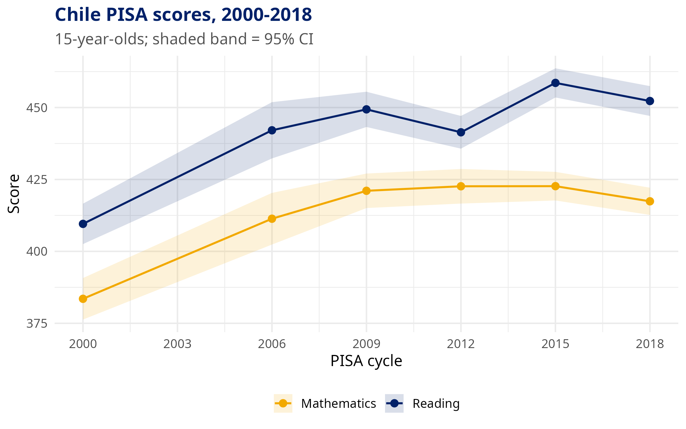
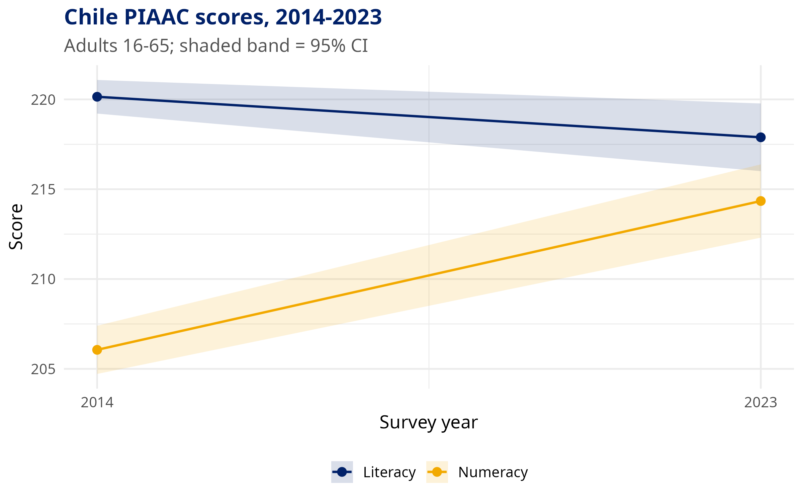
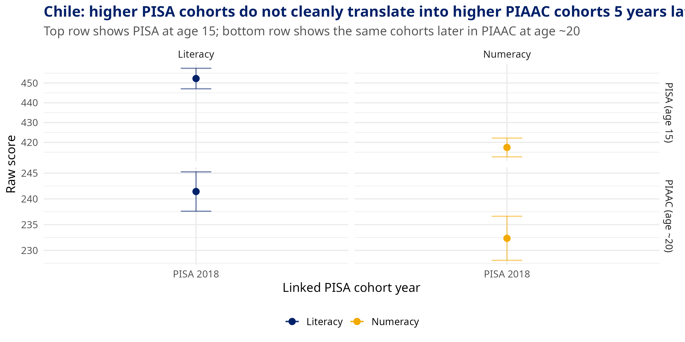
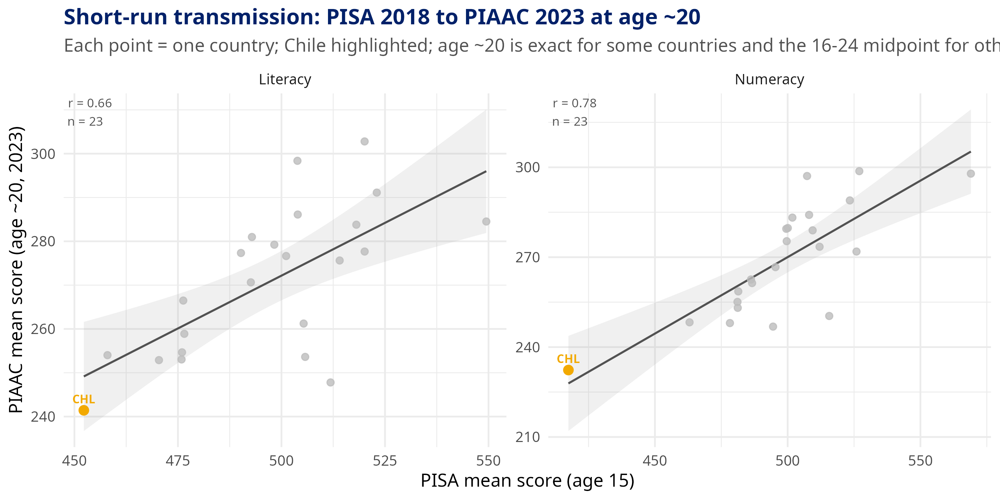
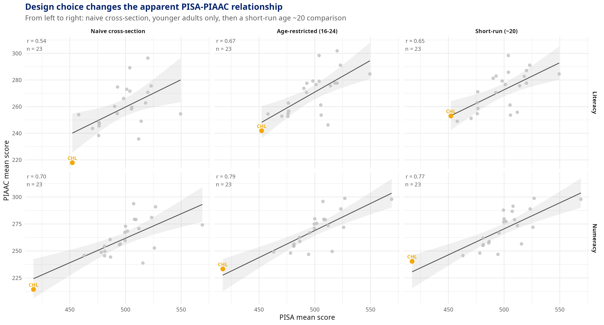
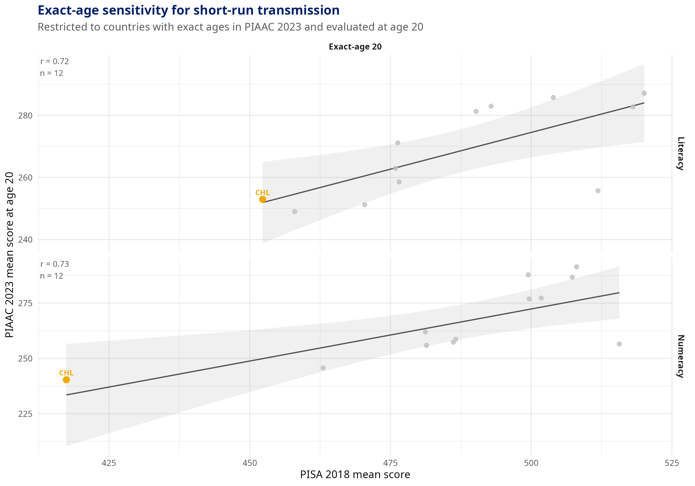

## The Puzzle

Chile is a useful place to start, but the evidence needs to be described carefully. In the local pipeline, Chile's PISA reading scores are somewhat higher in the later 2000s and 2010s than in 2006 and 2012, while the numeracy pattern is flatter. If those differences reflected durable improvements in the skills measured by OECD assessments, later adult cohorts should also tend to score higher when they appear in PIAAC.

The adult comparisons are more muted and less consistent than a simple transmission story would suggest.

That is the motivating question for this note:

> Do cross-country skill rankings persist across cohorts when we align PISA test-takers with the same cohort observed later in PIAAC?

The answer is yes, but the strength of that persistence depends on subject and design.

## Data and Design

This repo already contains microdata-derived country means for both surveys:

- PIAAC estimates are built from the public-use microdata with plausible values and replicate weights.
- PISA country means are cached microdata-derived estimates through 2018.
- In the working environment, the raw OECD source files live behind a Box-backed symlinked `00_data/` setup, but the fast default workflow uses the saved `02_output/*.rds` objects rather than a cold rebuild from source.

The core matched dataset is `02_output/cohort_pisa_piaac.rds`. Cohorts are linked by birth window: a PISA cohort observed at age 15 is matched to the closest observable young-adult cohort later in PIAAC. Where exact ages are available, that match is much tighter; where PIAAC only exposes broad age bands, it is necessarily approximate. Because PIAAC is a repeated cross-section rather than a panel, these are cohort-level comparisons, not repeated observations on the same individuals.

For the main cross-country comparison below, the focal specification is:

- PISA 2018 at age 15
- PIAAC 2023 at age ~20

This is the cleanest short-run comparison available in the current local pipeline. In some countries age 20 is observed exactly; in others it is the midpoint of the PIAAC 16-24 band, so the match should be read as approximate rather than exact. The saved main-spec dataset is `02_output/pisa_piaac_main_spec.csv`.

## Chile First

Chile is the right place to start, but it should not be shown as a single cross-survey z-score trajectory, and it should not be described as a point-change comparison across two different scales. The more defensible object is a raw-score cohort comparison within each survey: what happened to Chilean cohorts in PISA at age 15, and what happened to closely matched Chilean young-adult cohorts in PIAAC about five years later?

The school-age and young-adult series do not move in lockstep. In literacy, the later Chilean cohort is only modestly higher in PIAAC than the earlier one: the PISA 2009 cohort scored about 449 in reading and averaged about 239 in PIAAC literacy at age 20 in 2014, while the PISA 2018 cohort scored about 452 in reading and averaged about 241 in PIAAC literacy at age 20 in 2023. In numeracy, the mapping is even less mechanical: Chile's PISA math score is slightly lower in 2018 than in 2009, but the age-20 PIAAC numeracy mean is higher in 2023 than in 2014.

The key point is not that Chile is unique, or that its PISA gains simply "vanished." It is that Chile makes the identification problem intuitive: stronger PISA cohorts do not automatically reappear as clearly stronger young-adult cohorts a few years later, and the pattern is not identical across literacy and numeracy.

The cohort mapping behind this figure is saved in `02_output/chile_cohort_mapping.csv`.

## Cross-Country Persistence

Once the comparison is tightened to an approximately cohort-aligned match, persistence is still visible across countries.

Countries that score higher in PISA generally still score higher when the closest observable young-adult cohort is measured later in PIAAC. But the relationship is not uniform across subjects. In the main short-run specification, the correlation is about 0.66 for literacy and 0.78 for numeracy. That is the main result to carry forward:

- persistence exists across countries
- the effect is weaker and less stable than a single stylized correlation would suggest, especially in literacy
- Chile sits inside that broader pattern rather than outside it

## Why Design Matters

The apparent strength of the PISA-PIAAC relationship depends heavily on how the comparison is constructed.

Three patterns matter:

1. A naive cross-section mixes cohorts and life stages.
2. Restricting PIAAC to younger adults improves the alignment somewhat.
3. A short-run age ~20 comparison is the most relevant benchmark here if the question is whether higher PISA is associated with higher PIAAC a few years later.

This is why broad claims based on pooled adult averages are hard to interpret. PIAAC measures adult skills after schooling, work, skill use, depreciation, and selection have all had time to matter, so repeated-cross-section adult means bundle together several processes at once.

For countries with exact ages in PIAAC 2023, the tighter-age robustness checks are saved in `02_output/pisa_piaac_exact_age_sensitivity.csv` and shown here:

## Interpretation

The disciplined interpretation is narrower than the original broad draft, but stronger:

> Higher-scoring school cohorts tend to remain higher-scoring a few years later, but that correspondence is incomplete, subject-specific, and not well summarized by comparing point changes across PISA and PIAAC.

That leaves several possibilities open:

- post-school environments may reinforce or erode measured skills differently across countries
- PISA and PIAAC may capture overlapping but not identical abilities
- residual age-band mismatch and other measurement choices may attenuate the observed relationships

This note does not distinguish among those possibilities. It establishes the empirical pattern cleanly enough to motivate that next step.

## Reproducibility Note

This note is designed to be honest about the current state of the repo.

- Analysis-ready derived files are present in `02_output/`.
- The raw OECD source files are stored behind a Box-backed symlinked `00_data/` setup.
- The local PISA pipeline currently runs through 2018, not 2022.

So the present deliverable is a defensible replication note built on saved microdata-derived outputs, not a full cold-start rerun from source.
